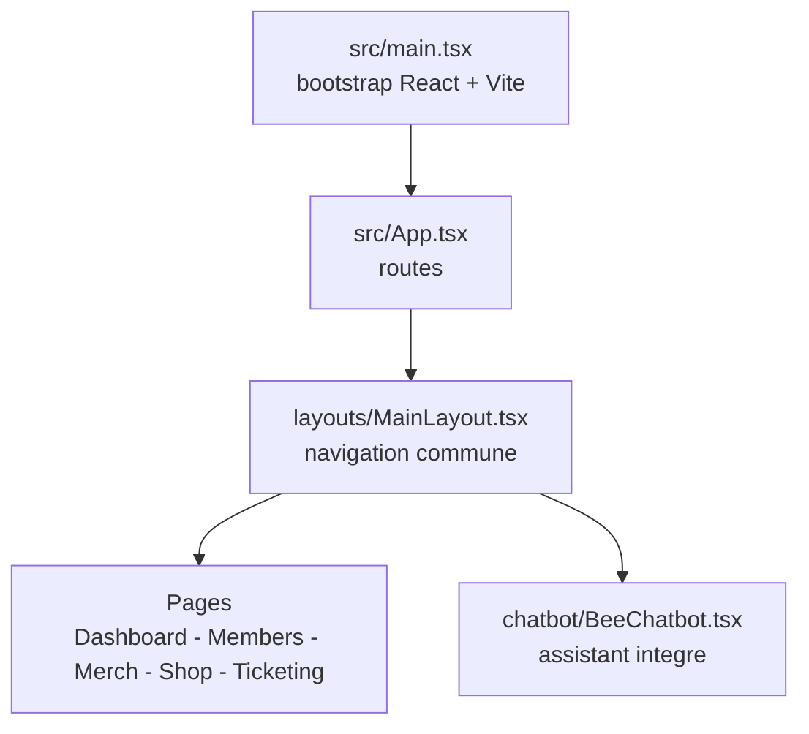

# BeeBle

<!-- adam-badges:start -->
    
<!-- adam-badges:end -->

Application web BeeBle - plateforme collaborative construite avec React + TypeScript + Vite + Tailwind.

---

 

  

## 📝 Description
Application web BeeBle.

## ⚡ Fonctionnalités
- Interface moderne
- Application web

### Construit avec les outils et technologies : 

   

🇫🇷 Français | 🇬🇧 Anglais | 🇪🇸 Espagnol | 🇮🇹 Italien | 🇵🇹 Portugais | 🇷🇺 Russe | 🇩🇪 Allemand | 🇹🇷 Turc

## Architecture

## Star History

<a href="https://www.star-history.com/?repos=Adam-Blf%2FBeeBle&type=date&legend=top-left">
 <picture>
   <source media="(prefers-color-scheme: dark)" srcset="https://api.star-history.com/chart?repos=Adam-Blf/BeeBle&type=date&theme=dark&legend=top-left" />
   <source media="(prefers-color-scheme: light)" srcset="https://api.star-history.com/chart?repos=Adam-Blf/BeeBle&type=date&legend=top-left" />
   
 </picture>
</a>
